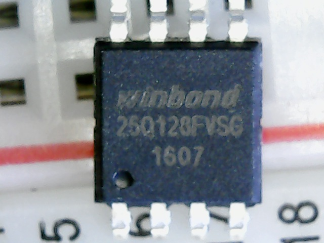
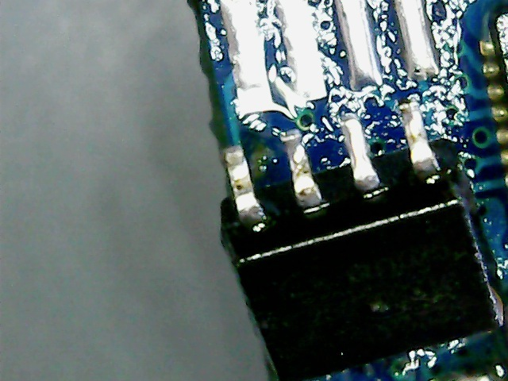
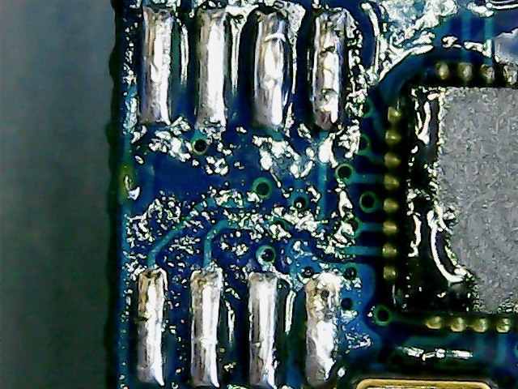
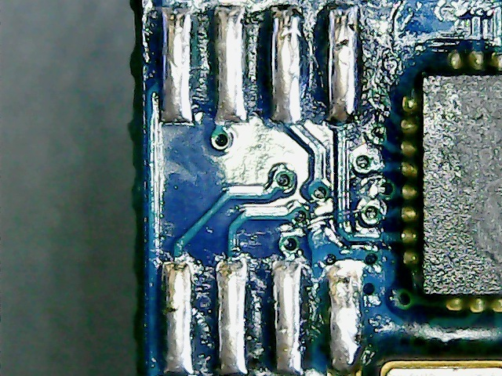
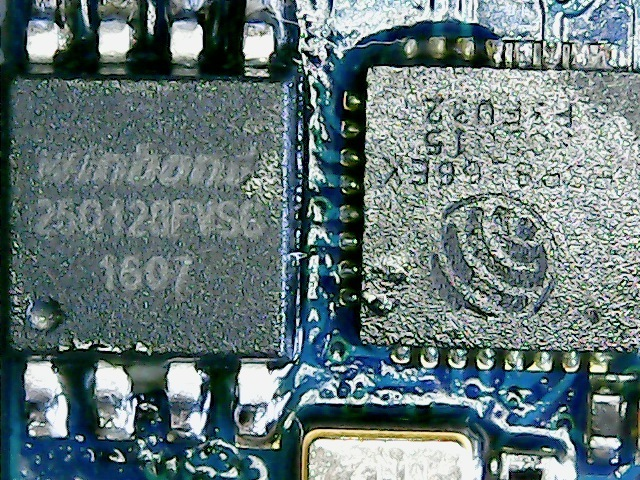
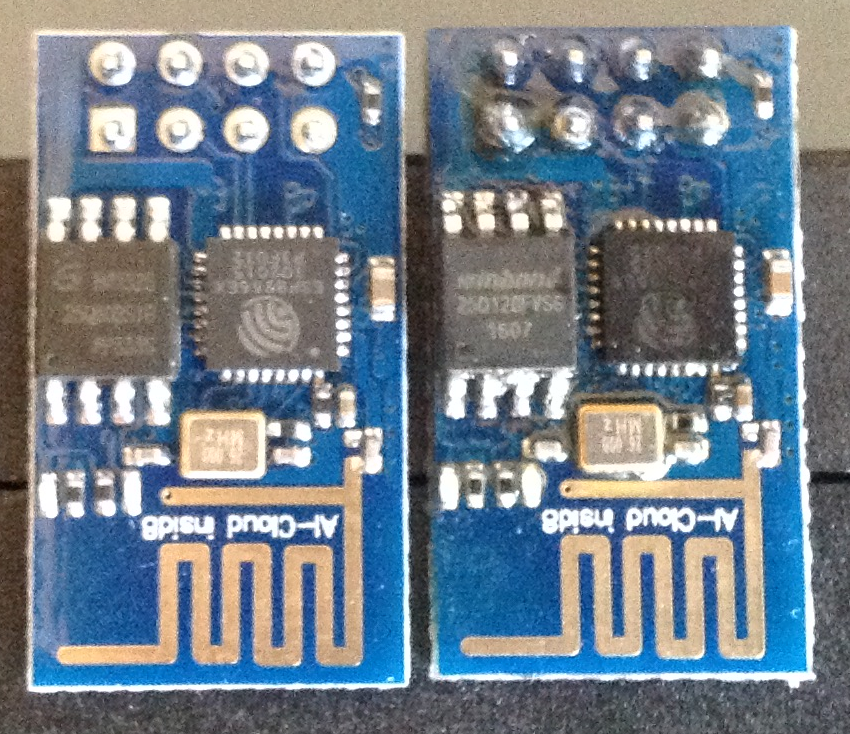

This tutorial provides a few hints on how to replace the flash IC on any ESP8266 uC ( here, the ESP-01 ).
For reference documentation about the esp8266 port of Espruino, please see the reference section: [EspruinoESP8266](http://www.espruino.com/EspruinoESP8266)

Steps involved:
- get the desired flash chip ( here, we'll use a Winbond W25Q128FV )
- apply flux "generously" ( but not too much ! ^^)
- remove original chip side by side
- add new solder
- quick cleanup
- install new chip
- profit

Get desired flash chip
----------------------

Nothing to see here, except the chip to be installed is a little wider than the original.
On few tutorials, it's advised to gently retract the pins underneath the iC, but the W25Q128FV seems to be a perfect fit.


Remove original chip
--------------------

Apply a sufficient amount of flux on both sides of the iC to be later able to quickly iron it up
( some may consider using a hot air blower to remove the chip, but I had no success - maybe not heating up enough .. ).

To remove the chip, hold it gently but fimrly with tweezers from one if its sides while it is held somehow securely
( ex: using a StickWise ), then iron all pins at once, before repeating the process for the opposite side.


Renew solder
------------

Add a thin layer of new solder to the pads to get proper connections afterward.


Quick cleanup
-------------

Before putting the new chip in place, use some alcohol to help evaporating the flux that's left.
Here we used acetone ( although I'll have to digg more the pro's & con's .. ).


Install new chip
----------------

We could solder the pins one by one, but the preffered ( & quicker / easier ) approach is to solder all pins of a side at once.
To do so, we can again apply solder flux before gently holding our chip with tweezers while we iron those pins.
Don't hesitate to softly press on the chip while doing so to avoid misconnection between the pins & the SMD pads.


Enjoy
-----

Now that the upgrade of the flash chip is complete, all that's left is to flash the esp chip it 
so that it handles the now increased amount of available flash memory.


We can look up flash chip & manufacturer codes at [flashchips.h](https://code.coreboot.org/p/flashrom/source/tree/HEAD/trunk/flashchips.h)

From the above file, we can get the following related to our chip:
```
884	/*
885	 * W25X chips are SPI, first byte of device ID is memory type, second
886	 * byte of device ID is related to log(bitsize).
887	 */
(..)
901	#define WINBOND_NEX_W25Q128_V  0x4018  /* W25Q128BV; W25Q128FV in SPI mode (default) */
(..)
909	#define WINBOND_NEX_W25Q128_W  0x6018  /* (No W version known) W25Q128FV in QPI mode */
```

For a 16MByte flash chip (our upgraded ESP-xx ): [
```
$ /path/to/esptool/esptool.py --port /dev/ttyUSB0 --baud 115200 \
  write_flash --flash_freq 80m* --flash_mode qio --flash_size 128m* \
  0x0000 "boot_v1.4(b1).bin" 0x1000 espruino_esp8266_user1.bin \
  0x3FC000* esp_init_data_default.bin 0x3FE000* blank.bin
```
WARNING: the above code excerpt hasn't been tested yet ! "things have to be figured out first" ( .. )

For reference documentation on flashing the ESP8266 with Espruino, please see the reference section: [ESP8266_Flashing](http://www.espruino.com/ESP8266_Flashing)
